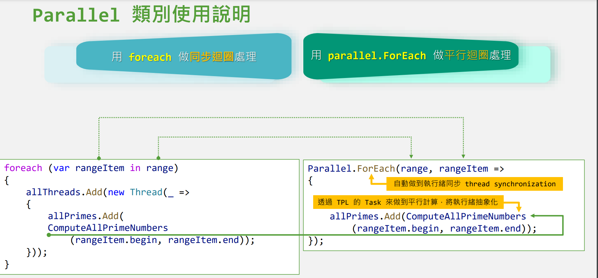

# 初探平行程式設計

### 平行

* CPU 執行
* 平行程式設計是非同步的一種
* 平行有兩種:資料(CPU)、工作(IO)兩種
* 非同步意味著多執行緒程式設計方式，但IO類的非同步不一定會用到多執行緒
* IO 動作  呼叫網路、存取記憶體、call 資料庫、磁碟等(脫離電腦或電腦以外的硬體存取:滑鼠鍵盤等)，IO工作項目上的效能問題加CPU沒有用
* 平行+IO : 使用非同步提升效能

> “Concurrency is about dealing with lots of things at once. Parallelism is about doing lots of things at once.” — Rob Pike

Task Parallel Library 平行類別庫(TPL)

#### Fork-Join 設計模式

* 承諾未來會執行完成，並且發出通知告知已完成作業(不管成功、失敗、TimeOut)

#### Thread

* 每個單獨的執行緒代表正在執行程式碼的路徑
* 記憶體共用
* 不是執行緒開越多就跑越快，要看電腦的平行處理能力(平行度)(邏輯處理器有八個，最多只能同時處理八個指令)
* 平行度 = 邏輯處理器數量(這台電腦是八個邏輯處理器，平行度就是8)

```csharp
List<Thread> allThreads = new List<Thread>(); // 平行計算執行緒
ConcurrentBag<List<int>> allPrimes = new ConcurrentBag<List<int>>(); // 安全執行緒未排序物件集合
for (int i = 0; i < partition; i++)
{
    int idx = i;
    allThreads.Add(new Thread(_ => // 使用 Thread 建立執行緒
    {
        allPrimes.Add(ComputeAllPrimeNumbers
            (range[idx].begin, range[idx].end));
    }));
}
foreach (var thread in allThreads) { thread.Start(); } // 啟動所有執行緒
foreach (var item in allThreads) { item.Join(); } // 同步等待
```

### 執行緒集區與工作 Task

#### 並行的非同步程式設計 Concurrency

* 若電腦只有一個處理器但有兩個執行緒，會交錯執行，每個執行緒只會執行一小段時間，就換其他執行緒執行
* 同個時間可以處理很多執行緒的指令(同時、交錯執行)
* A1->B1->A2->B2.....A執行完畢-> B執行完畢(不會等A執行完才執行B)
* [https://developer.mozilla.org/zh-TW/docs/Web/JavaScript/EventLoop](https://developer.mozilla.org/zh-TW/docs/Web/JavaScript/EventLoop)

```csharp
// 指定僅使用單一邏輯處理核心來執行
Process.GetCurrentProcess().ProcessorAffinity = (IntPtr)0b0010_0000;
```

如果指定同個核心的兩個邏輯處理器，沒辦法提升多少執行速度(執行緒在同個核心下執行，平行度1)

* 1LPX1C\
  Process.GetCurrentProcess().ProcessorAffinity = (IntPtr)0b1000;
*   2LPx1C

    Process.GetCurrentProcess().ProcessorAffinity = (IntPtr)0b1100;
*   2LPx2C

    Process.GetCurrentProcess().ProcessorAffinity = (IntPtr)0b1010;

### 執行緒集區 ThreadPool

* 工作排程/佔先式排程
* 內容交換 content Switch&#x20;
* 每個執行緒會有個 Program Couter 紀錄執行到哪行程式碼，在內容交換重新取出丟到CPU執行時才能繼續執行下一步
* 內容交換:把我現在的執行緒處理進度儲存回  Program Couter ，取出下一個執行緒出來

#### 執行緒集區與非同步工作

* database connection pool
* pool -> 幫你清除、歸還資源，不用 new 執行緒，不用 start、join
* AutoResetEvent > 執行緒集區中的執行緒執行完會收到訊號
* 有八個邏輯處理器，執行緒集區就會先預設建立好八個執行緒，當呼叫 ThreadPool.QueueUserWorkItem() ，就會要一個執行緒出來，丟到Ready Queue準備到 cpu 去執行，等沒有可用的執行緒後，待處理指令會在佇列排隊(如果都沒有執行完的執行緒歸還到集區，就會新增一個

```csharp
List<AutoResetEvent> autoResetEvents = new List<AutoResetEvent>();
for (int i = 1; i <= partition; i++)
{
    int begin = part * (i - 1) + 1;
    int end = part * i;
    if (begin < 2) begin = 2;
    if (i == partition) end = lastNumber;
    range.Add((begin, end));
    autoResetEvents.Add(new AutoResetEvent(false));
}
```

```csharp
ConcurrentBag<List<int>> allPrimes = new ConcurrentBag<List<int>>();
for (int i = 0; i < partition; i++)
{
    int idx = i;
    ThreadPool.QueueUserWorkItem(_ => // 透過執行緒集區取得執行緒
    {
        allPrimes.Add(ComputeAllPrimeNumbers
            (range[idx].begin, range[idx].end));
        autoResetEvents[idx].Set(); // 發出執行緒同步的訊號
    });
}

WaitHandle.WaitAll(autoResetEvents.ToArray()); // 執行緒同步
```

#### Task

* 執行緒封裝
* Task API: 解決 Blocking 封鎖等待-> 執行到程式碼要call 資料庫(如果需要很久)，就得等他執行完
* Task 可以使用 callback 或者 封鎖等待取得執行結果
* async / await 則是由編譯器產生額外程式碼 簡化非同步程式設計過程 -> 可以簡單的程式座程非同步，解決封鎖等待問題
* 透過工作排程器取得可用的執行緒

多工

* Muilti-Process: 每個 Request 一個Process\
  .png>)
* Single Tread(Event Loop)
* Multi-Tread: 一個應用程式多個執行緒執行指令

```csharp
List<Task> allTasks = new List<Task>();
for (int i = 0; i < partition; i++)
{
    int idx = i;
    allTasks.Add(Task.Run(() =>
    {
        allPrimes.Add(ComputeAllPrimeNumbers
            (range[idx].begin, range[idx].end));
    }));
}

// 等候 所有非同步工作 完成
Task.WaitAll(allTasks.ToArray());
```

### 執行緒、執行緒集區、Task 的差異?

* APM
* EAP:非同步委派執行完成訂閱一個委派方法
  * 有可能發生 CallBack 地獄
* TAP(Task-Based AsyncChornoun Pattern): 使用單一方法表示非同步作業的起始和完成
  * 經典案例:HttpClient

### 資料與查詢平行處理

#### Parallel.Foreach

<figure><figcaption></figcaption></figure>

<figure><figcaption></figcaption></figure>

#### ### PLINQ

```csharp
var allPrimes = range
    .AsParallel()
    .Select(rangeItem => ComputeAllPrimeNumbers(rangeItem.begin, rangeItem.end))
    .ToList();
```

